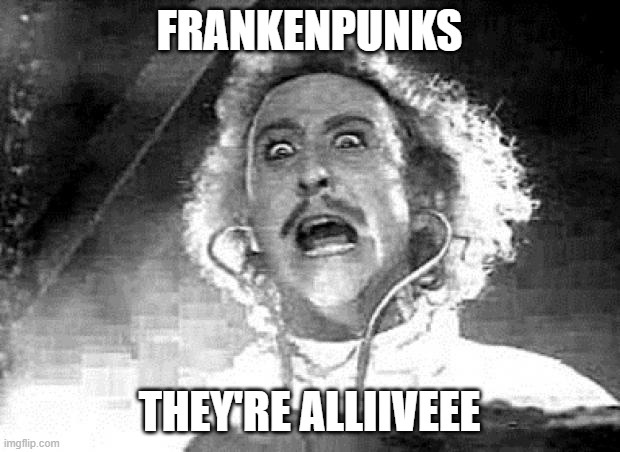

# 👋 Introduction

## What are 3D FrankenPunks?

### **10,000 Generative FrankenPunks at 0.088 ETH each**

Dr Ethvil is a mad genius that has created the FrankenPunks from the Punk Trash amidst the chilling NFT winter. These punks have been taken for a devilish deed...

This is a great opportunity... but with opportunity comes DANGER.&#x20;

To live, these punk monstrosities will need to be cared for by a group of do-good FrankenPunks and if cared for properly, they will be generously rewarded by Dr. Ethvil with tiny fractional pieces of these CryptoPunks Monstrosities being distributed to his most helpful Punksville community Members.&#x20;

Join us in the riskiest game in NFT history thus far...

### Rights of the FrankenPunk Holder

As a member of Punksville you are recognized as a holder of at least 1 FrankenPunk and are entitled to the following rights:

1. Contribute to project direction&#x20;
2. Propose how to use community funds &#x20;
3. Set the floor price of CryptoPunks
4. Be a passive member by delegating your decisions/votes to governors Vote leaders to be promoted to High Council and Governor roles&#x20;
5. Hold Leaders and other community members accountable&#x20;
6. Sell your FrankenPunk and leave the community

Our vision is to create a project focused on growing the FrankenPunks brand through a collaborative and community driven approach.

Everyone who owns a FrankenPunk has the ability to be heard!

### What do you receive as a community member of Punksville?

1. The right to propose and vote on the reserve price of Larva Labs Punks
2. Governance over community funds and associated vaults
3. Voting rights based on the number of rewards tokens generated
4. Setting the **reserve price of each Punk Vault**
5. Access to exclusive member-only channels
6. Exclusive real-world meetups and events

## Moving Into Punksville

Are you ready to embark on the journey through Punksville? First you need to buy ETH and setup your ETH wallet. If you do not already have ETH or a wallet, we have put together a "New to NFTs" guide:&#x20;

## &#x20;                 [NEW TO NFTS GUIDE LINK](broken-reference)

##
