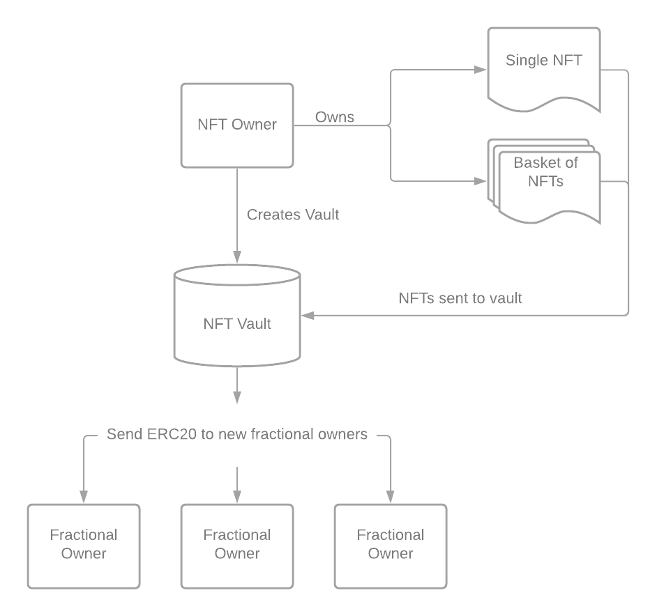

# 🏦 Fractionalized Vaults

## What is Fractionalization?

Fractionalization is the process of taking a full NFT and creating tokens (ERC20) that represent a percentage over the entire collection. During fractionalization of an NFT, the ERC721 token is locked into a smart contract that splits it into multiple parts by minting a fungible token.&#x20;

This makes it possible for Punksville DAO members to own and govern CryptoPunks as well as provide greater liquidity and efficient price discovery for the Punks Vault Assets. The key component of owning fractionalized tokens is the right to set the reserve price for the Punks Vault.&#x20;

We plan to use the fractional.art platform to vault and issue fractionalized tokens of the CryptoPunks.

## How it works

Fractionlization requires the NFT owner to send their NFTs to a vault. This vault acts as a custodian for the NFT and mints tokens (ERC20) that makeup the governance of the asset in the vault.&#x20;

