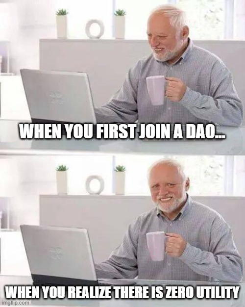

# 🎯 The Plan

This is not your average NFT project and we're doing a few things different to fix the holes we've seen from community governed projects of the past.

Like our predecessors, our primary goal of the project is to lower the barriers of entry to "**Blue Chip**" NFTs and grant full governance/ownership.&#x20;

**Coming Soon: A token called $FRANKEN will act as a reputational/governance token for the project. This on-chain incentive system is asset backed by the value and Performance of the Punks Vaults and Treasury. We plan to explore a tokenized legal structure at a later date.**&#x20;

## Our Milestones

_25% Sold_ - Buy first punk and transfer it to Punk Vault 1. Add 72 ETH to Punskville "Franken Bank".&#x20;

_50% Sold_ - Buy second punk and transfer it to Punk Vault 2 Add 72 ETH Punksville "Franken Bank".

_75% Sold_ - Buy third punk and transfer it to Punk Vault 3. Add 72 ETH to Punksville community wallet.&#x20;

_100% Sold_ - Buy fourth punk and transfer it to Punk Vault 4. Add 72 ETH to Punksville commnity wallet.

**Post Sell-Out:** Transfer Punk Vault tokens to the community governed gnosis wallet and release proposal system for Citizens to propose and approve uses of the community wallet and Punk Vaults.
